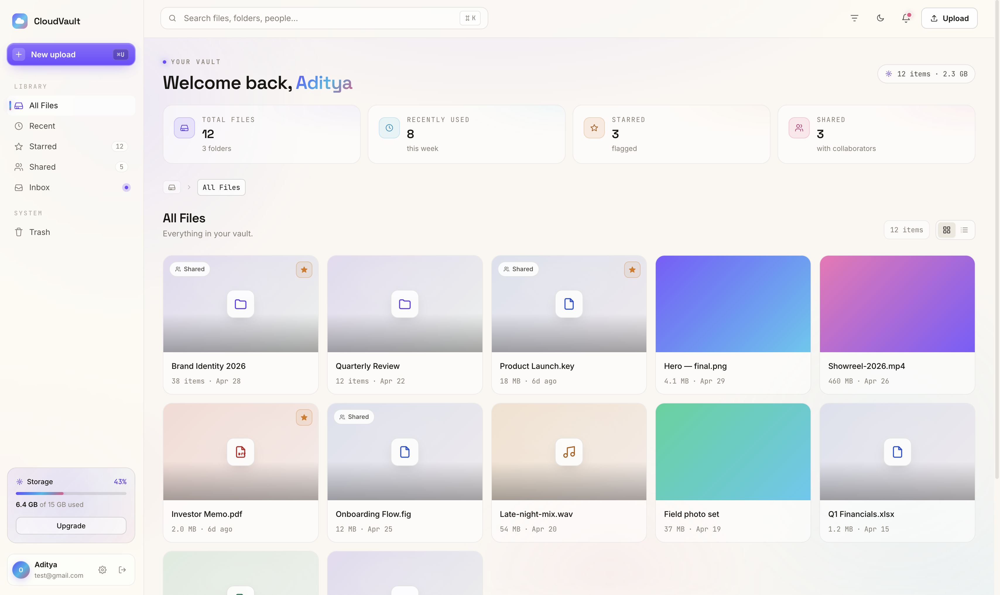

# CloudVault

CloudVault is a full-stack, local-first web application designed for personal cloud storage. It provides a platform for users to securely upload, manage, and retrieve their files and folders through a web interface.



## Architecture Overview

The application is structured as a monolithic frontend communicating with a RESTful backend API.

- **Frontend:** Built with React, TypeScript, and Vite. It handles the user interface, client-side routing, state management, and interactions with the backend API. It features both light and dark modes and a responsive design.
- **Backend:** Built with Spring Boot (Java 17+). It serves the REST API, manages authentication, handles file storage operations on the local file system, and interacts with the database for metadata storage.
- **Database:** Uses a relational database (SQLite/PostgreSQL) to store user credentials, folder hierarchies, and file metadata.

## Core Features

- **User Authentication:** 
  - User registration and login functionalities.
  - JWT (JSON Web Token) based authentication for securing API endpoints.
- **File Operations:**
  - **Upload:** Users can upload files of various types to the server.
  - **Download:** Authorized users can download their stored files.
  - **Delete:** Users can remove files from their storage space.
- **Folder Management:**
  - Hierarchical folder structures (nested folders).
  - Ability to create and delete folders to organize files.
  - Navigation through the directory tree.
- **Security:**
  - Password hashing for secure credential storage.
  - Endpoint protection ensuring users can only access their own files and folders.

## Technology Stack

### Backend
- **Java 17**
- **Spring Boot 3.x**
  - Spring Web (REST API)
  - Spring Security (Authentication & Authorization)
  - Spring Data JPA (Database interactions)
- **Database:** Relational Database (configurable via application properties, defaults to local DB)

### Frontend
- **React 18**
- **TypeScript**
- **Vite** (Build tool and development server)
- **CSS** (Custom styling with CSS variables for theming)

## Local Development Setup

To run CloudVault locally, you need to start both the backend server and the frontend development server.

### Prerequisites
- Java 17 or higher
- Node.js (v18 or higher)
- Maven

### 1. Backend Setup
1. Open a terminal in the root directory of the project.
2. Run the Spring Boot application using the Maven wrapper:
   ```bash
   ./mvnw spring-boot:run
   ```
3. The backend server will start on `http://localhost:8080`.

### 2. Frontend Setup
1. Open a new terminal instance and navigate to the `frontend` directory:
   ```bash
   cd frontend
   ```
2. Install the required Node.js dependencies:
   ```bash
   npm install
   ```
3. Start the Vite development server:
   ```bash
   npm run dev
   ```
4. The frontend application will be accessible at `http://localhost:5173`.

## Project Structure

- `/src/main/java/com/cloudvault`: Contains the backend Java source code (Controllers, Services, Models, Security configs).
- `/frontend`: Contains the React frontend application.
- `/uploads`: Default directory where uploaded files are stored on the local file system (managed by the backend).
